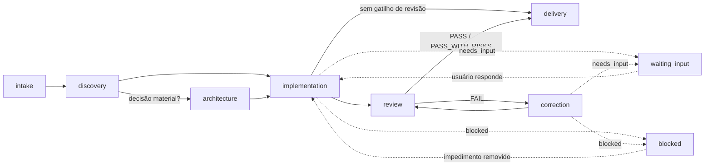
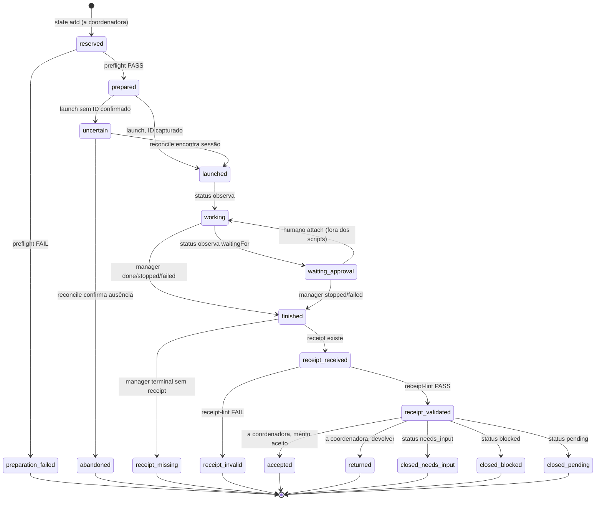

# Plano: estado estruturado e grafos do fluxo da coordenadora

- **Data:** 2026-09-18
- **Branch:** `feat/independent-visible-sessions` (HEAD `5abaed8`)
- **Status:** planejamento; nenhum script, schema definitivo ou alteração de contrato implementados
- **Base:** [`analise-scripts-apoio-coordenacao.md`](analise-scripts-apoio-coordenacao.md) (seções 4, 9, 10 e 12)
- **Escopo:** definir o estado estruturado de uma tarefa como estado de um grafo, planejar os grafos e loops do fluxo, e reordenar o roteiro da análise a partir desse modelo

## Sumário

1. [Por que grafos e loops](#1-por-que-grafos-e-loops)
2. [Esboço do estado estruturado](#2-esboço-do-estado-estruturado)
3. [G1 — grafo de fases da tarefa](#3-g1--grafo-de-fases-da-tarefa)
4. [G2 — máquina de estados de uma atribuição](#4-g2--máquina-de-estados-de-uma-atribuição)
5. [G3 — grafo de dependência entre atribuições](#5-g3--grafo-de-dependência-entre-atribuições)
6. [Loops e condições de parada](#6-loops-e-condições-de-parada)
7. [Scripts como transições](#7-scripts-como-transições)
8. [Melhorias sobre a análise](#8-melhorias-sobre-a-análise)
9. [Roteiro revisado](#9-roteiro-revisado)
10. [Respostas às perguntas em aberto](#10-respostas-às-perguntas-em-aberto)
11. [Decisões a confirmar](#11-decisões-a-confirmar)

---

## 1. Por que grafos e loops

A análise catalogou nove scripts como utilitários independentes (`preflight`, `gate`, `launch`, …). Este plano os reorganiza sob um único modelo: **uma tarefa é um grafo cujos nós são atribuições (`NN`) e cujas arestas são as regras de sequenciamento já escritas em prosa**. Cada script deixa de ser uma ferramenta avulsa e passa a ser uma **transição** ou um **predicado de aresta** desse grafo.

Três consequências práticas:

- O checkpoint deixa de ser um diário em prosa que a coordenadora reinterpreta a cada retomada e passa a ser o **estado persistido** do grafo — retomada é "ler o estado, achar o último nó, ver quais arestas estão habilitadas".
- As invariantes do protocolo (writer único, leitores sobrepõem só leitores, `NN` nunca reutilizado, nenhuma delegação recursiva) viram **validações sobre arestas**, verificáveis antes de lançar, em vez de itens de uma lista que a coordenadora precisa lembrar.
- Os ciclos do fluxo (correção ↔ revisão, monitoramento, clarificação, reconciliação) ganham **condição de parada explícita baseada em progresso**, não em contador — formalizando a regra existente "repeated failure without new evidence requires a fresh diagnosis".

O que **não** muda: o julgamento (roteamento, mérito do receipt, decidir correção × revisão × `needs_input`) continua na coordenadora; aprovações nativas continuam no humano via `claude attach`; nenhum lançamento é encadeado automaticamente. O grafo cuida do mecânico; a prosa continua sendo a fonte de verdade para o julgamento (análise, seção 5).

---

## 2. Esboço do estado estruturado

### 2.1 Separação entre estado mecânico e diário narrativo

| Arquivo | Conteúdo | Quem escreve | Quem lê |
|---|---|---|---|
| `.agent-state/<project>/tasks/<task>/state.toml` | Estado do grafo: nós, arestas, estados, IDs nativos, caminhos, allowlists, eventos | Scripts (`state add`, `preflight`, `launch`, `status`, `receipt-lint`, `reconcile`) e a coordenadora para campos de julgamento (`accepted`/`returned`) | Scripts, a coordenadora, `reviewer` |
| `.agent-state/<project>/tasks/<task>/checkpoint.md` | Diário: objetivo, critérios, decisões e seus motivos, autorizações com escopo, evidência narrativa, próximo passo | A coordenadora | A coordenadora, `reviewer`, usuário |

Regra de não duplicação: o diário **referencia** nós por `NN` e nunca repete campos do `state.toml`; o `state.toml` **nunca** contém motivos, decisões ou texto livre além de `note` curto por evento. Isso responde à pergunta 12.1 da análise (formato híbrido) sem criar uma terceira fonte de verdade: cada fato tem um único lugar.

### 2.2 Formato

**TOML**, por três motivos alinhados aos requisitos da análise (seção 10): leitura em stdlib (`tomllib`, Python ≥ 3.11, já exigido), o kit já usa TOML para `.codex/agents/*.toml`, e a estrutura necessária — uma tabela `[task]` e um array de tabelas `[[assignments]]` — é trivial de emitir com um escritor mínimo sem dependência. YAML exigiria PyYAML; JSON é stdlib mas hostil a leitura humana e a diffs. Alternativa registrada na seção 11.

### 2.3 Schema v0 (esboço)

```toml
# .agent-state/<project>/tasks/<task>/state.toml — estado mecânico do grafo da tarefa.
# Ignorado pelo Git. Nunca contém segredos, transcrições, env ou logs completos.
schema = 1

[task]
project    = "github-copilot-fullstack-kit"     # ^[a-z0-9-]+$; ver plano-memoria-por-projeto.md
slug       = "visible-sessions"                 # ^[a-z0-9-]+$
title      = "Visible sessions kit update"
phase      = "review"                            # ver G1
kit_root   = "/mnt/dados/GitHub/github-copilot-fullstack-kit"
targets    = ["/mnt/dados/GitHub/github-copilot-fullstack-kit"]
journal    = ".agent-state/github-copilot-fullstack-kit/tasks/visible-sessions/checkpoint.md"  # diário narrativo
next_nn    = 3                                   # monotônico; nunca decresce; = max(nn) + 1 (nó 03 omitido do esboço)
created_at = 2026-09-11T10:00:00-03:00
updated_at = 2026-09-18T09:00:00-03:00

# ---- um bloco por atribuição; append-only; NN nunca reutilizado ----

[[assignments]]
nn          = 1
role        = "node-backend"
type        = "implementação"        # implementação | revisão | correção | análise
mode        = "writer"               # writer | reader — derivado do papel, gravado
edge        = "inicia"               # ver G3
predecessor = 0                      # 0 = nenhum
targets     = ["/mnt/dados/GitHub/github-copilot-fullstack-kit"]
title       = "visible-sessions — node-backend — 01 — implementação"
state       = "preparation_failed"   # ver G2 (terminal; NN consumido)
handoff     = ".agent-state/github-copilot-fullstack-kit/tasks/visible-sessions/01-node-backend-handoff.md"
receipt     = ".agent-state/github-copilot-fullstack-kit/tasks/visible-sessions/01-node-backend-receipt.md"
git_before  = ""                     # não chegou a ser gravado
allowlist   = ["Bash(cd /mnt/dados/GitHub/github-copilot-fullstack-kit/.agent-state/github-copilot-fullstack-kit/tasks/visible-sessions/fixture && node --test)"]

  [assignments.native]
  platform      = "claude"           # claude | codex | unavailable
  id            = "182689df"         # Claude: id curto; Codex: threadId; unavailable: ""
  host          = ""                 # Codex: hostId
  reason        = ""                 # quando platform = unavailable: motivo divulgado
  last_seen     = "stopped"          # último estado observado no manager
  last_seen_at  = 2026-09-11T11:20:00-03:00

  [[assignments.events]]
  at   = 2026-09-11T11:00:00-03:00
  from = ""
  to   = "reserved"
  by   = "coordinator"                    # coordinator | user | preflight | launch | status | gate | receipt-lint | reconcile
  note = ""

  [[assignments.events]]
  at   = 2026-09-11T11:05:00-03:00
  from = "reserved"
  to   = "preparation_failed"
  by   = "preflight"
  note = "node não resolvido no PATH; lançamento não deveria ter seguido"

[[assignments]]
nn          = 2
role        = "reviewer"
type        = "revisão"
mode        = "reader"
edge        = "revisa"
predecessor = 1
targets     = ["/mnt/dados/GitHub/github-copilot-fullstack-kit"]
title       = "visible-sessions — reviewer — 02 — revisão"
state       = "accepted"
handoff     = ".agent-state/github-copilot-fullstack-kit/tasks/visible-sessions/02-reviewer-handoff.md"
receipt     = ".agent-state/github-copilot-fullstack-kit/tasks/visible-sessions/02-reviewer-receipt.md"
git_before  = ".agent-state/github-copilot-fullstack-kit/tasks/visible-sessions/git-before-02.txt"
allowlist   = ["Bash(git diff *)", "Bash(git status --short)"]

  [assignments.native]
  platform     = "claude"
  id           = "c1897dee"
  host         = ""
  reason       = ""
  last_seen    = "done"
  last_seen_at = 2026-09-11T14:00:00-03:00

  # Preenchido por receipt-lint a partir do receipt; só campos enumerados.
  [assignments.receipt_summary]
  status       = "done"              # done | pending | needs_input | blocked
  verdict      = "PASS_WITH_RISKS"   # `reviewer`: PASS | PASS_WITH_RISKS | FAIL; demais: ""
  profile_ok   = true                # profile_read == perfil do handoff
  risks_digest = [                   # títulos curtos normalizados; base do predicado de progresso (6.1)
    "preparation gate depends on coordinator discipline",
    "worktree isolation blocks receipt write",
    "read-only boundary is instruction-level",
  ]

  [[assignments.events]]
  at = 2026-09-11T12:00:00-03:00
  from = "reserved"
  to = "prepared"
  by = "preflight"
  note = ""
  # … launched → waiting_approval → working → done → receipt_received → receipt_validated → accepted
```

### 2.4 Campos e origem

| Campo | Origem | Observação |
|---|---|---|
| `nn`, `role`, `type`, `edge`, `predecessor`, `targets`, `allowlist` | A coordenadora (julgamento) via `state add` | Reserva do nó; `next_nn` incrementa |
| `mode` | Derivado do papel | `architect`, `reviewer`, analista-redmine = `reader`; demais = `writer` |
| `title`, `handoff`, `receipt`, `git_before` | Derivados por convenção | Nunca digitados |
| `state`, `events[]` | Transições (G2) | Append-only; `state` é sempre o `to` do último evento |
| `native.*` | `launch` (Claude) / a coordenadora (Codex, fallback) / `status` | `platform = "unavailable"` exige `reason` — é a divulgação "delegação visível indisponível" em forma estruturada |
| `receipt_summary.*` | `receipt-lint` | Só forma; mérito continua na coordenadora |

O que fica **fora** do `state.toml`: motivos de roteamento, autorizações e seus escopos, evidência por critério de aceitação, decisões superadas. Tudo isso permanece no diário, que continua obrigatório.

---

## 3. G1 — grafo de fases da tarefa

Fases do campo `task.phase`. É um grafo pequeno, com ciclos, que responde "em que ponto a tarefa está" sem olhar os nós individuais.



| Fase | Nós ativos permitidos | Quem decide a saída |
|---|---|---|
| `intake` | nenhum | A coordenadora |
| `discovery` | `Agent(Explore)` role-free; `analista-redmine`; leitores em paralelo | A coordenadora |
| `architecture` | `architect` (`reader`) | A coordenadora, com receipt do `architect` |
| `implementation` | exatamente um `writer` | gate + a coordenadora |
| `review` | `reviewer` (`reader`); nenhum `writer`; a coordenadora não edita o alvo | A coordenadora, com `verdict` |
| `correction` | exatamente um `writer` (mesmo papel do nó devolvido) | gate + a coordenadora |
| `waiting_input` | nenhum | usuário |
| `blocked` | nenhum | usuário / externo |
| `delivery` | nenhum | A coordenadora consolida |

A transição `implementation → delivery` sem revisão é válida apenas quando nenhum gatilho automático do `reviewer` se aplica (autorização, contrato público, integridade de dados, migração, operação crítica) e o usuário não pediu revisão. Isso é julgamento; o grafo apenas registra qual aresta foi tomada.

---

## 4. G2 — máquina de estados de uma atribuição

Estados do campo `assignments[].state`. Cada transição tem um agente responsável (`by`) e um predicado. Nenhuma transição é automática entre nós distintos — G2 termina no fechamento do nó; abrir o próximo é uma aresta de G3 decidida pela coordenadora.



### 4.1 Tabela de transições

| De | Para | Predicado | `by` | Escreve |
|---|---|---|---|---|
| — | `reserved` | A coordenadora escolheu papel/tipo/aresta; `nn = next_nn` | `coordinator` (via `state add`) | `state.toml` |
| `reserved` | `prepared` | Todas as verificações 4.1 da análise passam; `git-before-NN.txt` gravado | `preflight` | `git-before-NN.txt`, evento |
| `reserved` | `preparation_failed` | Qualquer verificação falha | `preflight` | evento com `note` = primeira falha |
| `prepared` | `launched` | Comando emitido **e** ID capturado | `launch` (Claude) / `coordinator` (Codex, após `create_thread`) | `native.*`, evento |
| `prepared` | `uncertain` | Comando emitido sem ID confirmado (timeout, erro de parse, `clientThreadId` apenas) | `launch` / `coordinator` | evento |
| `uncertain` | `launched` | Sessão encontrada no manager por título + cwd + janela de tempo | `reconcile` | `native.id`, evento |
| `uncertain` | `abandoned` | Manager não tem sessão compatível após reconciliação | `reconcile` | evento |
| `launched` | `working` / `waiting_approval` / `finished` | Observação do manager (`claude agents --json --all` / `wait_threads`) | `status` | `native.last_seen*`, evento |
| `waiting_approval` | `working` | Humano executou `attach`; scripts apenas observam a mudança | `status` | evento |
| `finished` | `receipt_received` | Arquivo `receipt` existe e não está vazio | `status` ou `gate` | evento |
| `finished` | `receipt_missing` | Manager terminal, receipt ausente após janela de espera | `gate` | evento |
| `receipt_received` | `receipt_validated` | Campos obrigatórios, enums, `profile_read` ≡ perfil, caminhos existem, sem heurística de segredo | `receipt-lint` | `receipt_summary.*`, evento |
| `receipt_received` | `receipt_invalid` | `receipt-lint` FAIL | `receipt-lint` | evento com `note` |
| `receipt_validated` | `accepted` | A coordenadora aceita o mérito; exige `status = done` e, para `reviewer`, `verdict ≠ FAIL` | `coordinator` | evento |
| `receipt_validated` | `returned` | A coordenadora devolve (findings do `reviewer`, ou implementação insuficiente) | `coordinator` | evento |
| `receipt_validated` | `closed_needs_input` / `closed_blocked` / `closed_pending` | Espelha `receipt_summary.status` | `coordinator` | evento |

### 4.2 Propriedades

- **Estados terminais fecham o nó, mas só `accepted` estabelece aceitação.** `closed_pending`, `closed_needs_input`, `closed_blocked`, `receipt_missing`, `receipt_invalid` fecham e exigem um sucessor via G3 (ou decisão do usuário).
- **`NN` é consumido em qualquer terminal**, inclusive `preparation_failed` e `abandoned` — formaliza "do not reuse its number after failure".
- **Um nó `writer` está "ativo"** em `prepared`, `launched`, `uncertain`, `working`, `waiting_approval`. `prepared` conta como ativo para que dois `preflight` sucessivos não preparem dois writers.
- **Nenhuma transição responde a aprovação.** `waiting_approval → working` é observada, nunca causada; a saída de `status` imprime `claude attach <id>` e para.
- **`uncertain` é um estado de primeira classe.** A análise trata resultado incerto como caso especial de retomada; aqui ele é um estado com apenas duas saídas, ambas via `reconcile`, o que impede lançar substituto sem reconciliar.

---

## 5. G3 — grafo de dependência entre atribuições

Cada nó tem exatamente um `predecessor` (0 para o primeiro) e uma `edge` que nomeia **por que** foi criado. A aresta é escolhida pela coordenadora; o predicado que a habilita é verificado por `gate`.

| `edge` | De (predecessor) | Para (novo nó) | Quando | Predicado de `gate` |
|---|---|---|---|---|
| `inicia` | nenhum | `writer` ou `reader` | Primeira atribuição da tarefa | P0 |
| `revisa` | `writer` em `accepted`/`closed_pending` | `reviewer` (`reader`) | Gatilho automático ou pedido explícito | P0 + P_reader |
| `analisa` | qualquer fechado, ou nenhum | `architect` / analista-redmine / `data-analyst` / mesmo papel com `type = análise` | Decisão material, histórico, ou loop sem progresso (6.1) | P0 + P_reader (ou P_writer se o papel escreve) |
| `corrige` | `reviewer` em `accepted` com `verdict = FAIL` | mesmo papel do writer revisado, `type = correção` | Findings a corrigir | P0 + P_writer + P_progresso (6.1) |
| `continua` | `closed_needs_input` (após resposta) / `closed_pending` | mesmo papel, mesmo `type` do predecessor | Trabalho restante ou resposta do usuário | P0 + P_writer/P_reader conforme `mode` |
| `substitui` | `preparation_failed` / `abandoned` / `receipt_missing` / `receipt_invalid` | mesmo papel, mesmo `type` | Nó fechou sem produzir resultado | P0 + P_writer/P_reader; **exige** que o predecessor esteja em terminal reconciliado |

Predicados:

- **P0 (sempre):** handoff do novo nó completo e legível; perfil e instruções do alvo existem; diretório de receipt existe; receipt do novo `NN` **não** existe; executáveis dos checks resolvem. (= `preflight`; `gate` apenas confirma que rodará.)
- **P_writer:** nenhum nó `writer` ativo (4.2) em **qualquer** tarefa cujos `targets` intersectem os do novo nó; predecessor fechado; receipt do último writer nos mesmos alvos validado; `git status/diff` atual comparado ao `git_before` desse writer, com diferenças listadas e reconhecidas no diário; manager sem sessão `working` desconhecida no mesmo cwd/alvo.
- **P_reader:** nenhum nó `writer` ativo nos mesmos alvos. Leitores podem coexistir com leitores e com discovery role-free.
- **P_progresso:** ver 6.1.

Invariantes verificadas por `state-lint` (parte de `kit-lint`, sobre a fixture e sobre qualquer `state.toml` passado como argumento):

1. `nn` estritamente crescente e contíguo; `next_nn = max(nn) + 1`.
2. `predecessor < nn` e existe (ou 0).
3. `edge` compatível com o estado do predecessor conforme a tabela acima.
4. No máximo um `writer` ativo por interseção de `targets`.
5. `state` de cada nó igual ao `to` do último evento; eventos com `at` monotônico.
6. `native.platform = "unavailable"` ⇒ `reason` não vazio; `= "codex"` ⇒ `host` não vazio quando `id` preenchido.
7. `mode` coerente com `role`.
8. Nenhum valor casa heurística de segredo.

---

## 6. Loops e condições de parada

### 6.1 Loop de correção — `writer → reviewer → FAIL → corrige → reviewer …`

Continua enquanto o `reviewer` devolve `FAIL` **com findings novos**. Termina por:

| Condição | Aresta seguinte | Quem decide |
|---|---|---|
| `verdict ∈ {PASS, PASS_WITH_RISKS}` | fase `delivery` | A coordenadora |
| `status ∈ {needs_input, blocked}` em qualquer nó | `continua` após o usuário | usuário → a coordenadora |
| **Sem progresso:** `risks_digest` da revisão *k* tem interseção substancial com o da revisão *k−1* (mesmos títulos normalizados) | `analisa` (mesmo papel com `type = análise`, ou `architect`), **não** `corrige` | `gate` recusa `corrige`; a coordenadora escolhe o destino da análise |
| Segundo `FAIL` consecutivo na mesma cadeia, mesmo com findings distintos | `corrige` permitido **somente após** decisão do usuário registrada no diário | A coordenadora pergunta; usuário decide |

O predicado **P_progresso** é a formalização de "repeated failure without new evidence requires a fresh diagnosis, not an arbitrary completion claim". Não é um contador: uma cadeia pode ter cinco correções se cada uma resolve findings distintos. A quarta linha é um ponto de humano-no-loop, não um limite — evita que a coordenadora insista sozinha em um ciclo caro.

O `risks_digest` é a única entrada mecânica do predicado; sua qualidade depende de `receipt-lint` extrair títulos de risco de forma estável. Se a heurística for fraca, o predicado degrada para "sempre pedir decisão ao usuário no segundo FAIL", que ainda é seguro.

### 6.2 Loop de monitoramento — `watch`

```
repetir a cada <intervalo> até <duração máxima>:
  observar manager (status)
  se estado do nó mudou → registrar evento, imprimir, SAIR
  se waiting_approval   → imprimir "claude attach <id>", SAIR
SAIR por tempo esgotado com o último estado observado
```

Termina ao **observar** uma transição; nunca a **provoca**. Intervalo e duração são argumentos obrigatórios (sem padrão infinito). Na sessão principal, o equivalente nativo é `/loop` ou `ScheduleWakeup` com intervalo compatível com a duração esperada da atribuição; a coordenadora decide o que fazer ao acordar.

### 6.3 Loop de clarificação — `needs_input`

`closed_needs_input` → usuário responde (fora do grafo) → a coordenadora cria nó `continua` com handoff atualizado → G2 do zero. Termina quando o nó sucessor fecha em qualquer outro estado. Não há limite: cada volta é uma decisão explícita do usuário.

### 6.4 Loop de reconciliação — retomada

```
ler state.toml + manager + git de cada alvo
para cada nó em uncertain / launched / working / waiting_approval:
  cruzar com manager por título, cwd, janela de tempo
  → transição observada (G2) ou marcar como "não reconciliado"
para cada sessão no manager com prefixo "<task> —" sem nó correspondente:
  → listar como órfã (nunca criar nó automaticamente)
repetir até nenhuma mudança OU lista de não reconciliados estável
```

Termina quando o estado é ponto fixo. Se restar algo não reconciliado, **somente** as arestas dependentes daquele nó ficam bloqueadas; o resto da tarefa pode prosseguir. `reconcile` propõe; a coordenadora registra a decisão.

---

## 7. Scripts como transições

Mapeamento dos casos de uso da análise (seção 4) para o modelo. Nenhum script novo é introduzido; `state` é a biblioteca comum, e `state-lint` entra em `kit-lint`.

| Script (análise) | No modelo | Lê | Escreve | Plataforma |
|---|---|---|---|---|
| `checkpoint add` / `next-nn` → **`state add`** | Cria nó em `reserved`; devolve `nn` | `state.toml` | `state.toml` | neutra |
| `preflight` | `reserved → prepared \| preparation_failed`; roda P0 | `state.toml`, handoff, perfis, alvos, `command -v`, manager (só leitura) | `git-before-NN.txt`, evento | neutra |
| `gate` | Avalia P_writer / P_reader / P_progresso para a aresta proposta; **não transita** — responde sim/não com motivos | `state.toml`, receipts, git, manager | nada | neutra + adaptador de manager |
| `launch-claude` | `prepared → launched \| uncertain`; encadeia `preflight`; um lançamento por invocação | handoff, `state.toml` | `native.*`, evento | Claude |
| `status-claude` / `watch-claude` | Observa `launched → working → waiting_approval → finished`; imprime `attach` | manager | `native.last_seen*`, evento | Claude |
| `receipt-lint` | `receipt_received → receipt_validated \| receipt_invalid`; preenche `receipt_summary` | receipt, handoff | `receipt_summary`, evento | neutra |
| `reconcile` | `uncertain → launched \| abandoned`; detecta órfãos; ponto fixo (6.4) | `state.toml`, manager, git | eventos | neutra + adaptador de manager |
| `handoff new` | Scaffold com campos derivados do nó `reserved` | `state.toml` | handoff | neutra |
| `kit-lint` (+ `state-lint`) | Invariantes de G3 sobre fixture e `state.toml` fornecido; paridade; TOML/YAML; `git diff --check` | kit | nada | neutra |

Transições de **julgamento** (`receipt_validated → accepted | returned | closed_*`, escolha de `edge`, escolha de papel) são gravadas pela coordenadora com `state add`/`state set` e nunca inferidas por script.

Codex: `state add`, `preflight`, `gate` (parte de arquivos/Git), `receipt-lint`, `reconcile` (parte de arquivos) e `kit-lint` funcionam sem adaptação. A coordenadora grava `native.platform = "codex"`, `id = threadId`, `host = hostId` manualmente após `create_thread`, e observa via `wait_threads`. A assimetria (análise 7.4) fica confinada aos dois adaptadores `*-claude`.

---

## 8. Melhorias sobre a análise

| Ponto da análise | Melhoria neste plano |
|---|---|
| 4.6 `checkpoint add` anexa blocos de campos fixos ao `.md` em prosa | Estado mecânico em `state.toml` separado; diário continua prosa pura. Scripts nunca parseiam prosa. |
| 12.1 formato do checkpoint em aberto | Respondido: híbrido com dois arquivos e regra de não duplicação (2.1). |
| Scripts como nove utilitários independentes | Scripts como transições e predicados de um único grafo (7); a tabela de transições é a definição canônica do procedimento mecânico, e os docs passam a referenciá-la — mitiga diretamente 7.1 "terceira fonte de verdade". |
| `type` usado só no título da sessão | `edge` nomeia a relação com o predecessor e habilita validação (`corrige` só após `FAIL`; `substitui` só após terminal sem resultado). |
| Resultado incerto tratado como caso de retomada | `uncertain` é estado de G2 com saída exclusiva por `reconcile`; impossível registrar substituto sem reconciliar (4.2). |
| "Falha repetida exige nova diagnose" permanece prosa | P_progresso (6.1) baseado em `risks_digest`; `gate` recusa `corrige` sem progresso e oferece `analisa`; segundo `FAIL` exige decisão do usuário. |
| Invariantes listadas em 2.3 | Viram oito verificações de `state-lint` (5), executáveis sobre fixture em `kit-lint` e sobre o estado real antes de qualquer lançamento. |
| `gate` verifica "receipt do predecessor + manager + git" | `gate` distingue P_writer de P_reader: leitores exigem apenas ausência de writer ativo nos mesmos alvos, o que libera revisões e análises sem esperar gates de Git desnecessários. Interseção de `targets` entre **todas** as tarefas, não só a atual. |
| 7.4 assimetria Codex | Estado neutro registra Codex (`id`/`host`) manualmente; seis dos nove scripts funcionam para Codex sem adaptação (7). |
| 7.9 sobre-automação | Explicitamente codificado: `gate` responde sim/não e nunca transita; `watch` sai ao observar; transições de mérito só por `coordinator`; quatro pontos de humano-no-loop nomeados (attach, lançamento, aceite/devolução, segundo FAIL). |
| Fallback "delegação visível indisponível" só em prosa | `native.platform = "unavailable"` + `reason` obrigatório; `state-lint` falha se faltar o motivo (5, invariante 6). |
| 4.4 `status` valida schema do manager | Mantido; adiciona `native.last_seen*` como registro da última observação, útil para `reconcile` por janela de tempo. |
| 9 roteiro em três etapas | Etapa 0 de schema e fixture antes de qualquer script; `state` como biblioteca comum antes de `preflight` (9). |

---

## 9. Roteiro revisado

### Etapa 0 — modelo (este plano)

- Confirmar decisões da seção 11.
- Escrever `tests/fixtures/visible-sessions/state.toml` derivado do checkpoint real, sanitizado, cobrindo: `preparation_failed` (01), `waiting_approval → accepted` com `PASS_WITH_RISKS` (02, 03), um nó `unavailable` (fallback Codex) e um nó `uncertain → abandoned` sintético.
- Documentar o schema v0 e as tabelas de G2/G3 em `docs/agent-workflow.md` como contrato; o diário continua descrito em prosa.
- Revisão do `reviewer` sobre o contrato (é mudança de contrato do kit — análise 7.8/11).

### Etapa 1 — estado e gates neutros

- Biblioteca `state` (ler/escrever/validar `state.toml`; escritor TOML mínimo para o subconjunto usado).
- `state add` / `state set` / `next-nn`.
- `preflight` como transição `reserved → prepared | preparation_failed`.
- `kit-lint` com `state-lint` (invariantes 1–8) e os checks já existentes (paridade, TOML/YAML, `git diff --check`).
- `receipt-lint` com `receipt_summary` e `risks_digest` — antecipado da Etapa 2 porque `gate` depende dele.
- Testes `unittest` sobre a fixture; `kit-lint` os executa.
- Revisão do `reviewer` sobre `scripts/`.

### Etapa 2 — adaptadores e predicados

- `gate` com P_writer, P_reader, P_progresso.
- `launch-claude`, `status-claude`, `watch-claude` com validação de schema do manager.
- Cadeia real em Claude: implementação → revisão → correção → revisão, inteiramente registrada em `state.toml`; diário referencia nós por `NN`.
- Uma cadeia com `FAIL` repetido de propósito para exercitar P_progresso e o ponto de decisão do usuário.

### Etapa 3 — opcionais

- `reconcile` (ponto fixo de 6.4) e `handoff new`.
- Hook `PreToolUse` (análise, seção 8) somente após Etapa 2 validada e decisão explícita sobre `settings.json` de projeto.

### Critério de aceitação da iniciativa (revisado)

- Cadeia real de quatro atribuições em Claude sem lançamento após `preparation_failed`, sem flag esquecida, com `state.toml` passando em `state-lint` ao final de cada transição.
- `state-lint` vermelho em cada uma das oito invariantes quebradas de propósito (uma fixture negativa por invariante).
- `gate` recusa `corrige` numa fixture com `risks_digest` repetido e aceita com `risks_digest` distinto.
- `kit-lint` verde no kit atual e vermelho numa quebra de paridade introduzida de propósito.
- Receipt do `reviewer` `PASS` ou `PASS_WITH_RISKS` sobre o contrato (Etapa 0) e sobre `scripts/` (Etapa 1), com os riscos 7.2 e 7.3 da análise avaliados.

---

## 10. Respostas às perguntas em aberto

| # (análise 12) | Resposta proposta |
|---|---|
| 1. Formato do checkpoint | Híbrido: `state.toml` mecânico + `.md` narrativo, com regra de não duplicação (2.1). |
| 2. Cobertura Codex | Estado neutro registra `threadId`/`hostId` manualmente; scripts neutros funcionam; só `launch`/`status`/`watch` são Claude. Nenhum arquivo intermediário extra. |
| 3. `settings.json` de projeto / hooks | Adiar para Etapa 3; o grafo torna `preflight` estável e testado antes, que é o pré-requisito que a análise (seção 8) já impunha. |
| 4. Versão mínima do CLI | Avisar e prosseguir na versão; **falhar** apenas em divergência de schema do JSON do manager (que é o que quebra de fato). |
| 5. Fixture | Versionada em `tests/fixtures/`, derivada e sanitizada do `.agent-state/` real; `.agent-state/` continua ignorado. |

---

## 11. Decisões a confirmar

| ID | Decisão | Recomendação | Alternativa |
|---|---|---|---|
| D1 | Formato do estado mecânico | TOML (stdlib para leitura; kit já usa; escritor mínimo trivial) | YAML (PyYAML obrigatório) ou JSON (stdlib, pior para humanos e diffs) |
| D2 | Escopo de P_writer | Interseção de `targets` entre **todas** as tarefas com `state.toml` no kit | Só a tarefa atual (mais simples; perde o caso de duas tarefas no mesmo alvo) |
| D3 | `risks_digest` | Títulos de risco normalizados extraídos por `receipt-lint`; predicado por interseção | A coordenadora informa manualmente "mesmos findings: sim/não" ao criar o nó (`gate` só exige o campo) |
| D4 | Ponto de decisão no segundo `FAIL` | Obrigatório e registrado no diário antes de `corrige` | Apenas aviso |
| D5 | `prepared` conta como writer ativo | Sim (impede dois `preflight` sucessivos para writers) | Não (ativo só a partir de `launched`) |
| D6 | Estados terminais sem resultado (`receipt_missing`, `receipt_invalid`) | Terminais; sucessor via `substitui` | Reabrir o mesmo nó (contraria "nunca reutilizar sessão") — **não recomendado** |
| D7 | Onde documentar G2/G3 | `docs/agent-workflow.md` (contrato) com este plano como racional | Manter só neste documento |

Nenhum item acima altera as invariantes da análise (2.3) nem o que deve permanecer fora dos scripts (5). Todos são detalhes do modelo, não de postura.
